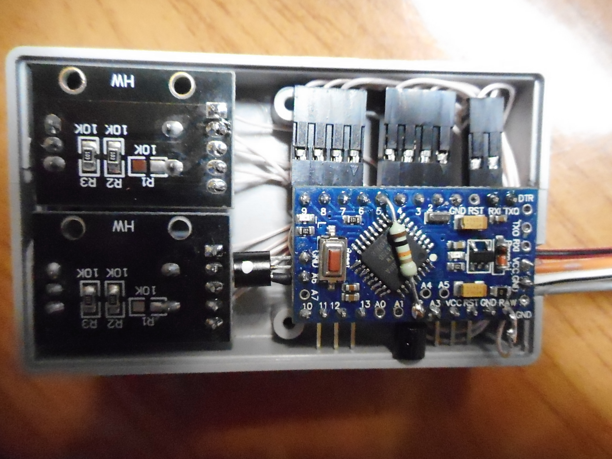
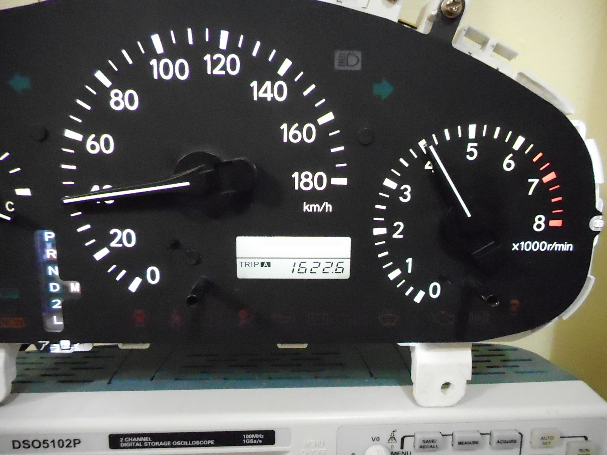
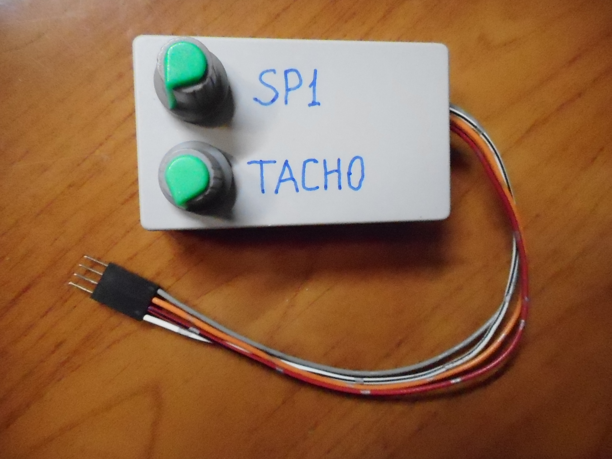
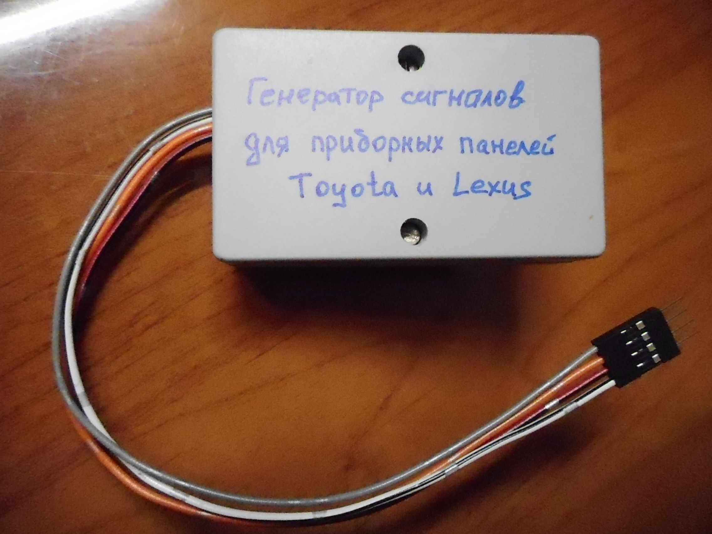

# Toyota SP1 and TACH signals generator #

This is a generator for testing Toyota and Lexus combination meters.


## Hardware ##

* Arduino Pro mini board
* 2 x Arduino encoders 
* 2 x transistors
* 3 x resistors
* Wires and connectors


## Get sources ##

```
git clone https://github.com/specadmin/toyota_SP1_TACH
cd toyota_SP1_TACH
git submodule update --init
```


## Code modification ##

Use Code::Blocks or any other IDE for code modification.


## Pictures ##

<div align="center">  </div>

<div align="center">  </div>

<div align="center">  </div>

<div align="center">  </div>
